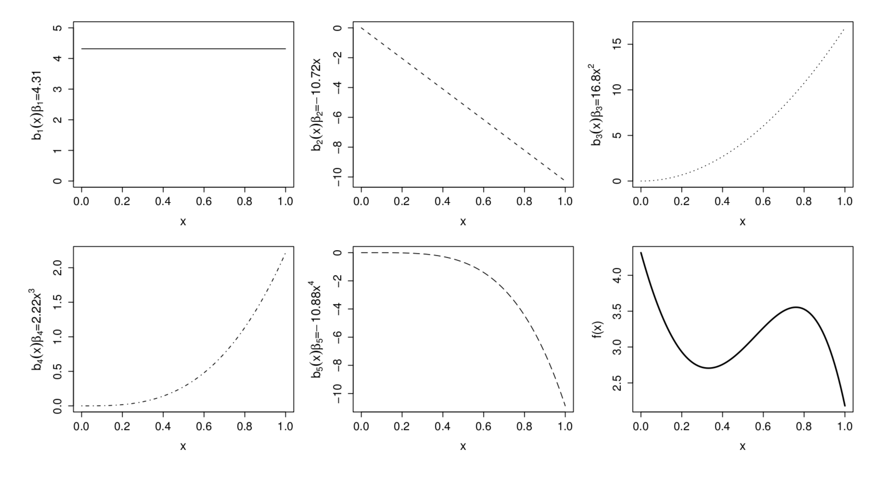
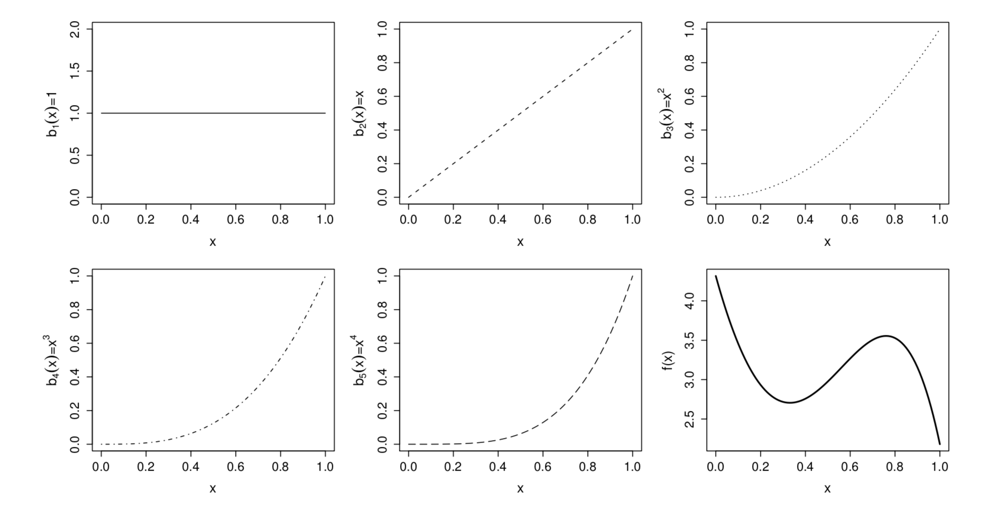
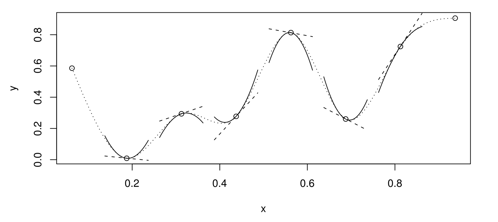
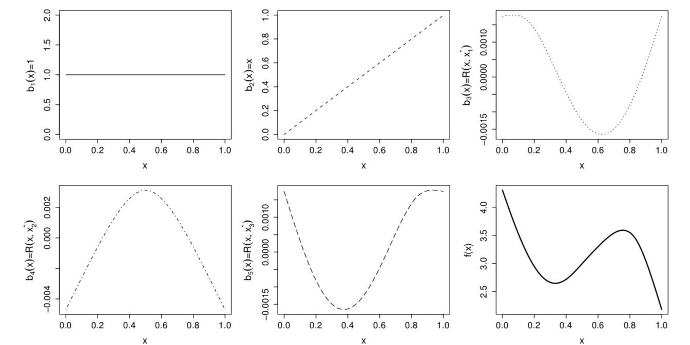
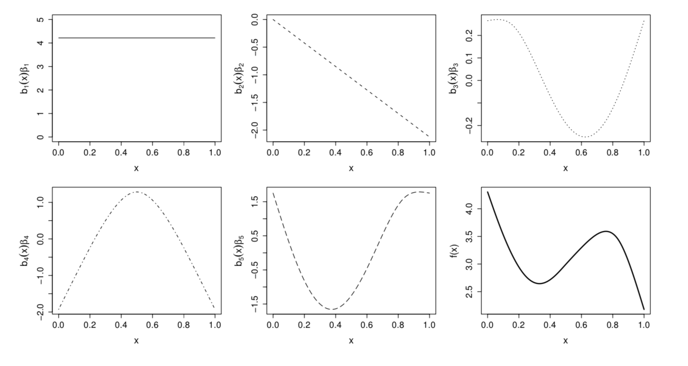

```{r setup, include=FALSE}
knitr::opts_chunk$set(echo = FALSE)
```


# General form

- **Generalized additive model** is a generalized linear model with a linear predictor, involving a sum of smooth functions of covariates.

$g(u_i) = X^*_i \theta + f_1(x_{1i}) + f_2(x_{2i}) + f_3(x_{3i}, x_{4i}) + ...$ (eqn. 3.1)

- GAM specifies the model with **smooth functions** rather than detailed parametric relationships.


# Univariate smooth functions $f$

$y_i = f(x_i) + \epsilon_i$ (eqn. 3.2)

$y_i$ : response variable \
$f$ : **smooth function** \
$x_i$ : covariate \
$\epsilon_i$ : i.i.d. $N(0, \sigma^2)$ variable (error) \

- Represent the smooth function *f* in a way that (eqn. 3.2) becomes a linear model. 
- The smooth function *f* can then be expressed as some \
  *basis functions* $(b)$ with parameter $\beta$
  
$f(x_i) = \sum_{j=1}^{q} b_j(x)\beta_j$


# Simple example of smooth function: 4<sup>th</sup> order polynomial basis

$f(x) = \beta_1 + x\beta_2 + x^2\beta_3 + x^3\beta_4 + x^4\beta_5$

{width=350px}

{width=350px}

- Polynomial basis can be problematic...**spline bases** are more common


# Cubic spline basis

- A univariate function represented using a cubic spline. 

- A cubic spline is a curve, made up of sections of cubic polynomial, joined together so that they are continuous in value as well as first and second derivatives 

{width=400px}

- Determine the location of knots: evenly spaced or at quantile of distribution of x

- Determine a number of **knots (k)** 

 $\{x_i^*:i=1,...,q-2\}$  (why?) 
 

# 

- Fit $y$ with $k$ cubic functions plus one constant and one 1<sup>st</sup> term

$b_1(x)=1, b_2(x)=x,...,b_{i+2}(x,x_i^*)$

- The cubic function is written in **eqn 3.4** 

- cubic spline function in *R* (`z` is rank $q$)
```{r, echo=TRUE}
rk <- function(x, z) # R(x,z) for cubic spline on [0,1] 
  { 
  ((z-0.5)^2-1/12) * ((x-0.5)^2-1/12)/4- ((abs(x-z)-0.5)^4-(abs(x-z)-0.5)^2/2+7/240)/24
}
```


# rank 5 cubic regression spline basis 

{width=500}


{width=500}


#

When $k = 4$, there are 4 cubic functions.\
```{r}
lala <- seq(0.01, 1, 0.01)
knot <- 1:4/5
plot(rk(lala, knot) ~ lala)
```


# Example of cubic spline basis

Data
```{r, echo = TRUE}
size <- c(1.42,1.58,1.78,1.99,1.99,1.99,2.13,2.13,2.13,2.32,2.32,2.32,2.32,2.32,2.43,2.43,2.78,2.98,2.98)
wear <- c(4.0,4.2,2.5,2.6,2.8,2.4,3.2,2.4,2.6,4.8,2.9,3.8,3.0,2.7,3.1,3.3,3.0,2.8,1.7)

x <- size - min(size)
x <- x/max(x)
```

Function for generating the model matrix
```{r, echo = TRUE}
spl.X <- function(x,xk) # set up model matrix for cubic penalized regression spline 
  { q <- length(xk) + 2 # number of parameters 
    n <- length(x) # number of data 
    X <- matrix(1, n, q) # initialized model matrix 
    X[,2] <- x  # set second column to x
    X[,3:q] <- outer(x, xk, FUN = rk) # and remaining to R(x,xk) 
    X
}
```


#

Results...\
```{r, echo}
xk <- 1:4/5 # choose some knots
X <- spl.X(x,xk) # generate model matrix 
mod.1 <- lm(wear~X-1) # fit model
xp <- 0:100/100 # x values for prediction 
Xp <- spl.X(xp,xk) # prediction matrix 

plot(x,wear,xlab="Scaled engine size",ylab="Wear index")
lines(xp,Xp%*%coef(mod.1)) # plot fitted spline
```


# Knots determine the smoothness

- How many knots?

- **Penalized regression splines**

  Minimize the following...$||y - X\beta|| + \boldsymbol{\lambda \int_{0}^{1}[f''(x)]^2dx}$ \
  
  High $\lambda$ penalizes high wiggliness ($\int_{0}^{1}[f''(x)]^2dx$)
  
  Fig. 3.8
  
- Still need to determine a number of knots


# To determine $\lambda$

- Ordinary cross validation (OCV) \
  Leave one data point at a time when doing cross validation

- Generalized cross validation (GCV) \
  Use *influence matrix* to estimate the deviance when leaving one data point out
  Fig. 3.10
  

# Additive model (more than one $x$)

$y_i = f_1(x_{1i}) + f_2(x_{2i}) + \epsilon_i$

All calculations are conceptually the same as mentioned above.


# Generalized additive model

Due to the link function, penalized likelihood is being maximized. 

In practice, **penalized iteratively re-weighted least square (P-IRLS)** is implemented. 
